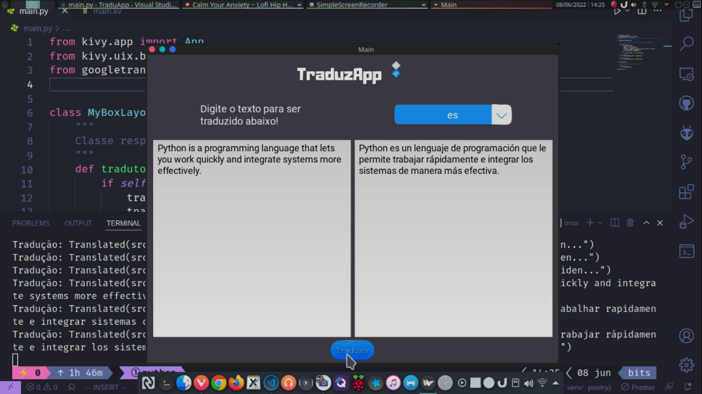

# TraduzApp
### Uma aplicação simples para tradução de texto desenvolvida em Python usando a biblioteca Kivy e sua linguagem de Marcação kivylang.



Use uma env exclusiva para o projeto, para isso você precisa ter o pip3, python3 e (virtualenv ou poetry ou pyenv) instalado em sua máquina, tendo, faça:

**Usando Virtualenv No Linux**
```
virtualenv .venv
source .venv/bin/activate
pip install kivy
pip3 install googletrans==4.0.0-rc1
```

**Usando Virtualenv No Windows**
```
virtualenv .venv
.venv/Scripts/Activate
pip3 install kivy
pip3 install googletrans==4.0.0-rc1
```

**Usando o Poetry**
```
poetry shell
poetry add kivy
poetry add kivy googletrans==4.0.0-rc1
```

